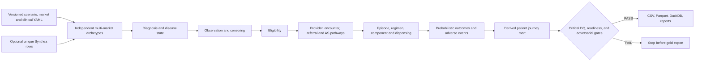

# Architecture

> **SYNTHETIC DEMO DATA — NOT REAL PATIENT OR CLINICAL DATA**

Generation uses one seeded NumPy random stream in a fixed module order. Patient archetypes are independent and raw source IDs are never sampled with replacement. Clinical and business rules are loaded from `clinical_rules.yaml`; market behavior comes from `markets.yaml`.

The observation/censor table is generated before pathway, treatment, or outcome events. Every event generator receives the censor date and caps or suppresses events beyond it. Normalized tables are built first; `patient_journey` is then derived from those records rather than independently sampled.

Feature timing metadata marks downstream and outcome variables as forbidden for earlier prediction tasks. Patient splits use a stable seed/market/archetype hash, which prevents patient or archetype overlap across train, validation, and test.

For a full profile, `run-all` generates all tables twice with the same seed and requires exact DataFrame equality before recording reproducibility as verified. Critical DQ, readiness, or independently recalculated adversarial failures stop export.
