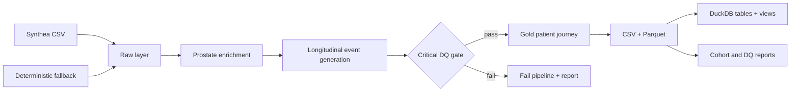

# Architecture

> **SYNTHETIC DEMO DATA – NOT REAL BAYER OR CLINICAL DATA**

The single seeded NumPy generator flows through cohort, provider, diagnosis, eligibility, encounters, treatment and outcomes. Baseline features are generated before future outcomes to avoid target leakage. CSV supports inspection; Parquet is the typed analytical contract; DuckDB supports local SQL. A future version may add a Synthea Generic Module for prostate states and validate its events before retaining the same downstream contract; this should be clinically reviewed and versioned rather than changing Synthea core.

