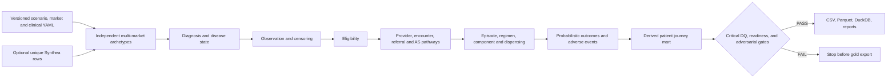

# Architecture

> **SYNTHETIC DEMO DATA — NOT REAL PATIENT OR CLINICAL DATA**



Generation uses one seeded NumPy random stream in a fixed module order. Patient archetypes are independent and raw source IDs are never sampled with replacement. Clinical and business rules are loaded from `clinical_rules.yaml`; market behavior comes from `markets.yaml`.

The observation/censor table is generated before pathway, treatment, or outcome events. Every event generator receives the censor date and caps or suppresses events beyond it. Normalized tables are built first; `patient_journey` is then derived from those records rather than independently sampled.

Feature timing metadata marks downstream and outcome variables as forbidden for earlier prediction tasks. Patient splits use a stable seed/market/archetype hash, which prevents patient or archetype overlap across train, validation, and test.

For a full profile, `run-all` generates all tables twice with the same seed and requires exact DataFrame equality before recording reproducibility as verified. Critical DQ, readiness, or independently recalculated adversarial failures stop export.

The stricter `final-release` path then reloads the exact exported files, verifies CSV/Parquet values
and DuckDB row counts, independently reconciles ten mart concepts, runs task-cutoff leakage and
synthetic-realism diagnostics, requires all 11 final scorecard dimensions to be 100, reruns the
test/lint suite, and seals separate analytical and QA archives with complete hash manifests.

## Candidate-bound evidence layers

The scientific and predictive layers are generated only from one verified analytical release. Each
snapshots its contracts/configuration, records the release and source commit on aggregate outputs,
builds a file-hash manifest, and seals the package. The presentation builder verifies those seals and
copies only explicit aggregate allow-lists.

For prediction, four versioned target contracts drive exact population derivation. Feature encoding,
scaling and Platt calibration are fit within training/calibration periods; repeated rolling temporal
folds, one untouched final temporal holdout and development-only leave-one-market-out folds have
separate roles. Leakage audits and governance dispositions fail closed. Model cards and
`model_story.html` contain aggregate evidence only—patient-level probabilities and deployable model
aliases are excluded.

## Local application and cloud-portable boundary

```mermaid
flowchart LR
    A[Analytical CLI] --> W[Mutable working outputs]
    A --> R[Immutable certified release]
    R --> P[Release-matched aggregate presentation]
    R --> V[Integrity verifier]
    P --> V
    V --> S[Single-process static analytics service]
    S --> H[/health — process alive]
    S --> D[/ready — release and presentation verified]
    E[Future experiments or AI services] -. isolated .-> X[outputs/experiments]
```

The local service does not regenerate analytics. It reads one accepted release and one matching
aggregate presentation, verifies their manifests/hashes, and serves only files listed by the
presentation manifest. Working data, certified releases, presentation outputs, temporary files and
future experiments have non-overlapping typed namespaces. Optional future services are outside the
normal analytics readiness path.

The current cloud target is AWS documentation only. See
[AWS target architecture](AWS_TARGET_ARCHITECTURE.md) and
[deployment contract](DEPLOYMENT_CONTRACT.md). The previous GCP checklist is superseded history.
