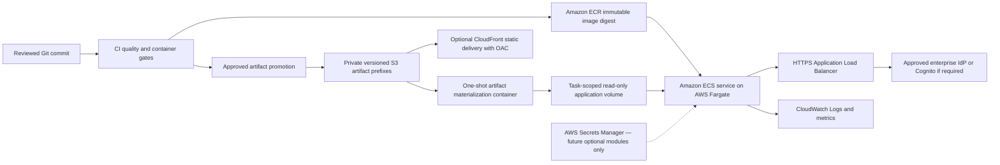

# AWS target architecture — proposed, not deployed

> **STATUS: DOCUMENTATION ONLY.** No AWS account was accessed, no credential was used, no API call
> was made, no resource was created, and no cloud cost was incurred by this implementation.

> **SYNTHETIC SCENARIO OUTPUTS ONLY.** This architecture is not approved for real patient data,
> clinical decision support, RWE validation, production authorization, or Bayer population claims.

## Minimum credible target



The current image is cloud-neutral and does not contain AWS SDK code or credentials. For the
container-service mode, a proposed one-shot container in the same Fargate task materializes exactly
one approved release and presentation prefix from S3 into a shared task volume. The main container
receives that volume read-only, verifies all local manifests and hashes, then becomes ready. This
keeps S3 access out of the analytics application and gives the init and runtime containers separate
IAM responsibilities.

For a static-only internal demonstration, the simpler supported choice is a private S3 origin plus
CloudFront and approved authentication, without ECS. Use ECS only when the operational health,
readiness, provenance gateway, or later approved application services are actually required.

## Components and boundaries

| Component | Responsibility | Explicit non-responsibility |
|---|---|---|
| Git + CI | test source, build once, record commit/image digest, promote approved artifacts | no production auto-deploy from an unreviewed branch |
| ECR | immutable runtime image tagged by commit and addressed by digest | no patient or analytical artifacts inside image |
| S3 certified prefix | versioned release archive, checksum inventory, presentation aggregate package | no mutable working analysis and no experiment promotion |
| ECS/Fargate | run `prostate-journey serve`, expose `/health` and `/ready`, serve allow-listed aggregates | no analytical regeneration and no model training |
| One-shot artifact container | retrieve one approved S3 version into task-scoped storage | no modification after handoff to the app |
| ALB | TLS termination, target health, controlled ingress | no public raw-artifact access |
| CloudFront | optional cache/delivery for approved static package | no direct public S3 bucket |
| Secrets Manager | future optional secrets only | OpenAI is not required by current readiness |
| CloudWatch | JSON stdout/stderr, service and alarm telemetry | no patient-level payload logging |
| Cognito/enterprise IdP | authentication when approved and required | no authentication claim in the current local app |

AWS documents that ECS task health depends on health checks in the task definition, so the handoff
requires both a container liveness command and an ALB readiness path:
[ECS container health checks](https://docs.aws.amazon.com/AmazonECS/latest/developerguide/healthcheck.html).

Task execution and application task roles remain separate. The execution role pulls ECR images,
resolves task-definition secrets, and sends logs; the task role grants only application-specific
access such as the init container's selected S3 prefix:
[ECS IAM role guidance](https://docs.aws.amazon.com/AmazonECS/latest/developerguide/security-iam-roles.html).

CloudWatch receives the application's one-line JSON stdout/stderr through the Fargate `awslogs`
configuration:
[ECS CloudWatch logging](https://docs.aws.amazon.com/AmazonECS/latest/developerguide/using_awslogs.html).

## Artifact design

Proposed key layout:

```text
s3://<approved-artifact-bucket>/
  releases/<release-id>/...
  presentations/<release-id>/...
  experiments/<experiment-id>/...       # never accepted by current readiness
```

- Enable S3 Versioning.
- Use separate IAM prefixes and explicit deny controls between releases and experiments.
- Evaluate S3 Object Lock for the certified prefix; Object Lock uses versioned WORM protection and
  must be selected with governance/legal owners:
  [S3 Object Lock](https://docs.aws.amazon.com/AmazonS3/latest/userguide/object-lock.html).
- Preserve release and presentation manifests, checksums, object version IDs, CI run ID, source
  commit, image digest, and promotion approval as one audit record.
- Never update a release ID in place. Publish a new version and change the selected release.

If CloudFront serves the static package directly, use a regular private S3 bucket origin with Origin
Access Control, signed origin requests, and HTTPS; do not use a public S3 website endpoint:
[CloudFront OAC guidance](https://docs.aws.amazon.com/AmazonCloudFront/latest/DeveloperGuide/private-content-restricting-access-to-s3.html).

## Network target

- One approved AWS Region, selected through privacy, security, residency, and platform review.
- Fargate tasks in private subnets.
- ALB in private subnets for enterprise-only access, or controlled public subnets only when a formal
  external ingress requirement and WAF/authentication design are approved.
- Security group: ALB receives HTTPS from approved sources; task receives port 8080 only from ALB.
- VPC endpoints for ECR, CloudWatch Logs, Secrets Manager, and S3 should be assessed against cost and
  private-network requirements.
- Current main container requires no outbound internet. The artifact init container needs only the
  selected S3 objects and supporting KMS access.

## Deliberately excluded

No EKS, Kubernetes, Kafka, Kinesis, OpenSearch, feature store, multi-region active-active, multiple
databases, online model endpoint, or general-purpose agent platform is justified for the current
application. The future Evidence Copilot and Specialist Analysis Agent are outside this prompt.
