# Entity-Relationship Schema

> **Synthetic demo data only.** This diagram documents the current 19-table CSV,
> Parquet, and DuckDB export contract. It does not describe real Bayer or clinical
> data.

The physical model is patient-centred. Solid relationships below are exported key
relationships. `patient_journey` is a one-row-per-patient analytical mart derived
from the normalized domains; `feature_timing` governs its columns by
`feature_name` rather than by a physical database foreign key.

```mermaid
erDiagram
    PATIENT {
        string patient_id PK
        string source_patient_id
        string source_archetype_id UK
        date birth_date
        date index_date
        int age_at_index
        string market_code
        string market_depth
        string region
        string insurance_type
        float access_index
        int comorbidity_score
        float frailty_proxy
        string complexity_segment
        string synthetic_scenario_version
    }

    DIAGNOSIS {
        string diagnosis_id PK
        string patient_id FK
        date diagnosis_date
        string prostate_stage
        boolean metastatic_flag
        boolean hormone_sensitive_flag
        boolean castration_resistant_flag
        string risk_group
        float psa_value
        int gleason_primary_pattern
        int gleason_secondary_pattern
        int gleason_score
        int isup_grade_group
        string clinical_state_model_version
    }

    DISEASE_STATE_EVENT {
        string disease_state_event_id PK
        string patient_id FK
        date state_date
        string state
        string previous_state
        string transition_reason
        string clinical_state_model_version
    }

    ELIGIBILITY {
        string eligibility_id PK
        string patient_id FK
        boolean mhspc_flag
        boolean eligibility_flag
        string eligibility_status
        date eligibility_date
        string eligibility_reason
        string ineligibility_reason
        boolean contraindication_flag
        boolean data_sufficiency_flag
        int possible_followup_days
        string eligibility_rule_version
        date censor_date_at_generation
    }

    ORGANIZATION {
        string organization_id PK
        string market_code
        string region
        string organization_type
        string care_setting
        boolean academic_flag
        boolean multidisciplinary_team_flag
    }

    PROVIDER {
        string provider_id PK
        string organization_id FK
        string market_code
        string region
        string provider_specialty
        string care_setting
        boolean academic_flag
        int annual_prostate_volume
        boolean multidisciplinary_team_flag
    }

    ENCOUNTER {
        string encounter_id PK
        string patient_id FK
        string provider_id FK
        string organization_id FK
        date encounter_date
        string encounter_type
        string provider_specialty
        string care_setting
        int sequence_number
        string detail_level
    }

    REFERRAL {
        string referral_id PK
        string patient_id FK
        string source_provider_id FK
        string source_organization_id FK
        string destination_provider_id FK
        string destination_organization_id FK
        string source_specialty
        string destination_specialty
        date referral_date
        date completion_date
        string referral_status
        string referral_reason
        string decision_owner_specialty
    }

    ACTIVE_SURVEILLANCE {
        string active_surveillance_id PK
        string patient_id FK
        boolean as_eligibility_flag
        date as_start_date
        string as_status
        date as_exit_date
        string as_exit_reason
        boolean as_reclassification_event_flag
        date as_reclassification_date
        boolean transition_to_treatment_flag
        date planned_treatment_start_date
        int monitoring_event_count
        string active_surveillance_rule_version
    }

    OBSERVATION {
        string observation_id PK
        string patient_id FK
        date observation_start_date
        date observation_end_date
        date last_observed_date
        date loss_to_follow_up_date
        date death_date
        date censor_date
        string censor_reason
        int follow_up_days_from_diagnosis
        string observation_rule_version
    }

    TREATMENT_EPISODE {
        string treatment_episode_id PK
        string patient_id FK
        string previous_episode_id FK
        string prescribing_provider_id FK
        string tracking_component_id FK
        int treatment_line
        date treatment_start_date
        date treatment_end_date
        string treatment_status
        string treatment_intent
        string episode_reason
        string transition_type
        boolean discontinuation_flag
        date discontinuation_date
        boolean switch_flag
        date switch_date
        boolean restart_flag
        date restart_date
        boolean temporary_gap_flag
    }

    TREATMENT_REGIMEN {
        string regimen_id PK
        string treatment_episode_id FK
        string patient_id FK
        string regimen_name
        string regimen_type
        string combination_strategy
        date regimen_start_date
        date regimen_end_date
        string regimen_status
        boolean intensification_flag
        string guideline_concordance_classification
        string guideline_rule_version
    }

    TREATMENT_REGIMEN_COMPONENT {
        string component_id PK
        string regimen_id FK
        string treatment_episode_id FK
        string patient_id FK
        string drug_name
        string drug_class
        string component_role
        string route
        date component_start_date
        date component_end_date
        string component_status
        int planned_cycle_count
        int cycle_length_days
        boolean dispensing_detail_available_flag
    }

    PRESCRIPTION_EVENT {
        string prescription_event_id PK
        string patient_id FK
        string treatment_episode_id FK
        string regimen_id FK
        string component_id FK
        date service_date
        string product_id
        string drug_name
        string drug_class
        float quantity_dispensed
        int days_supply
        date nominal_covered_until_date
        date covered_until_date
        string event_type
        int refill_gap_days
        string refill_timing
        string adherence_profile
    }

    ADVERSE_EVENT {
        string adverse_event_id PK
        string patient_id FK
        string treatment_episode_id FK
        date adverse_event_date
        string adverse_event_type
        string severity
        boolean serious_event_flag
        string outcome_model_version
    }

    OUTCOME {
        string outcome_id PK
        string patient_id FK
        boolean progression_event
        date progression_date
        boolean castration_resistant_transition
        date castration_resistant_date
        boolean hospitalisation_flag
        date first_hospitalisation_date
        boolean adverse_event_flag
        int adverse_event_count
        boolean death_flag
        date death_date
        boolean lost_to_follow_up_flag
        date loss_to_follow_up_date
        date censor_date
        string censor_reason
        string outcome_status
        string outcome_model_version
    }

    PATIENT_SPLIT {
        string patient_split_id PK
        string patient_id FK
        string source_archetype_id
        string market_code
        string split
        string split_rule_version
    }

    FEATURE_TIMING {
        string feature_metadata_id PK
        string feature_name UK
        string availability_stage
        string allowed_use_cases
        boolean future_information_flag
        boolean predictor_allowed_flag
        string availability_condition
        boolean target_label_flag
        string timing_rule_version
    }

    PATIENT_JOURNEY {
        string patient_id PK,FK
        string source_archetype_id
        string market_code
        string complexity_segment
        string denominator_status
        boolean eligibility_flag
        string initial_care_setting
        string pathway_care_setting
        string referral_status
        string active_surveillance_status
        boolean treatment_initiated
        string treatment_episode_id FK
        date treatment_start_date
        string initiation_90d_status
        string regimen_at_treatment_start
        string regimen_type_at_treatment_start
        string combination_strategy_at_treatment_start
        boolean intensification_at_treatment_start_flag
        string initial_regimen
        boolean intensification_flag
        boolean discontinuation_flag
        boolean switch_flag
        boolean restart_flag
        date censor_date
        string persistence_12m_status
        string final_outcome_status
        string synthetic_scenario_version
    }

    PATIENT ||--|| DIAGNOSIS : has
    PATIENT ||--o{ DISEASE_STATE_EVENT : has
    PATIENT ||--|| ELIGIBILITY : assessed_as
    PATIENT ||--o{ ENCOUNTER : attends
    PATIENT ||--o{ REFERRAL : follows
    PATIENT ||--o| ACTIVE_SURVEILLANCE : may_enter
    PATIENT ||--|| OBSERVATION : observed_under
    PATIENT ||--o{ TREATMENT_EPISODE : receives
    PATIENT ||--o{ TREATMENT_REGIMEN : receives
    PATIENT ||--o{ TREATMENT_REGIMEN_COMPONENT : receives
    PATIENT ||--o{ PRESCRIPTION_EVENT : has
    PATIENT ||--o{ ADVERSE_EVENT : experiences
    PATIENT ||--|| OUTCOME : has
    PATIENT ||--|| PATIENT_SPLIT : assigned_to
    PATIENT ||--|| PATIENT_JOURNEY : summarized_by

    ORGANIZATION ||--o{ PROVIDER : employs
    ORGANIZATION ||--o{ ENCOUNTER : hosts
    ORGANIZATION ||--o{ REFERRAL : sources
    ORGANIZATION ||--o{ REFERRAL : receives
    PROVIDER ||--o{ ENCOUNTER : performs
    PROVIDER ||--o{ REFERRAL : sends
    PROVIDER ||--o{ REFERRAL : receives
    PROVIDER ||--o{ TREATMENT_EPISODE : prescribes

    TREATMENT_EPISODE o|--o{ TREATMENT_EPISODE : precedes
    TREATMENT_EPISODE ||--|| TREATMENT_REGIMEN : contains
    TREATMENT_EPISODE ||--o{ TREATMENT_REGIMEN_COMPONENT : contains
    TREATMENT_EPISODE ||--o{ PRESCRIPTION_EVENT : emits
    TREATMENT_EPISODE ||--o{ ADVERSE_EVENT : contextualizes
    TREATMENT_REGIMEN ||--o{ TREATMENT_REGIMEN_COMPONENT : comprises
    TREATMENT_REGIMEN ||--o{ PRESCRIPTION_EVENT : emits
    TREATMENT_REGIMEN_COMPONENT ||--o{ PRESCRIPTION_EVENT : dispensed_as
    TREATMENT_REGIMEN_COMPONENT o|--o{ TREATMENT_EPISODE : tracked_by
    TREATMENT_EPISODE o|--o{ PATIENT_JOURNEY : initial_episode_for

```

## Relationship and grain contract

| Child field | Parent field | Cardinality / meaning |
|---|---|---|
| Every domain `patient_id` | `patient.patient_id` | All clinical and analytical records resolve to one patient. |
| `provider.organization_id` | `organization.organization_id` | Each provider belongs to one stable organization. |
| `encounter.provider_id` | `provider.provider_id` | Encounter specialty and setting must match the provider master. |
| `encounter.organization_id` | `organization.organization_id` | Must also equal the encounter provider's organization. |
| `referral.source_provider_id`, `destination_provider_id` | `provider.provider_id` | Source and destination are distinct real provider-master rows. |
| `referral.source_organization_id`, `destination_organization_id` | `organization.organization_id` | Organizations reconcile through the referenced providers. |
| `treatment_episode.previous_episode_id` | `treatment_episode.treatment_episode_id` | Nullable self-reference for switch/restart lineage. |
| `treatment_episode.prescribing_provider_id` | `provider.provider_id` | Prescriber specialty must be compatible with the regimen components. |
| `treatment_episode.tracking_component_id` | `treatment_regimen_component.component_id` | Component used for persistence reconstruction. |
| `treatment_regimen.treatment_episode_id` | `treatment_episode.treatment_episode_id` | One exported regimen per episode in the current contract. |
| `treatment_regimen_component.regimen_id` | `treatment_regimen.regimen_id` | One or more components form a regimen. |
| `treatment_regimen_component.treatment_episode_id` | `treatment_episode.treatment_episode_id` | Denormalized lineage that must agree with the regimen. |
| `prescription_event.component_id`, `regimen_id`, `treatment_episode_id` | Corresponding treatment keys | Every dispensing event resolves through the full treatment hierarchy. |
| `adverse_event.treatment_episode_id` | `treatment_episode.treatment_episode_id` | Dated event occurs within the associated observed treatment context. |
| `patient_journey.treatment_episode_id` | `treatment_episode.treatment_episode_id` | Nullable reference to the patient's first episode. |
| `feature_timing.feature_name` | `patient_journey` column name | Logical governance contract; every mart column has exactly one metadata row. |

`market_code` is repeated as an analytical partition attribute. Market assumptions are
versioned in `configs/markets.yaml`; there is intentionally no exported market
dimension table. The active-surveillance-to-treatment link is reconstructed by
`patient_id` plus `planned_treatment_start_date` because the AS table deliberately
records a planned clinical transition rather than a treatment-episode foreign key.
